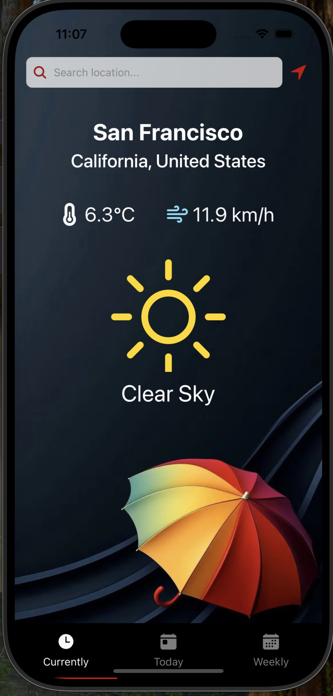
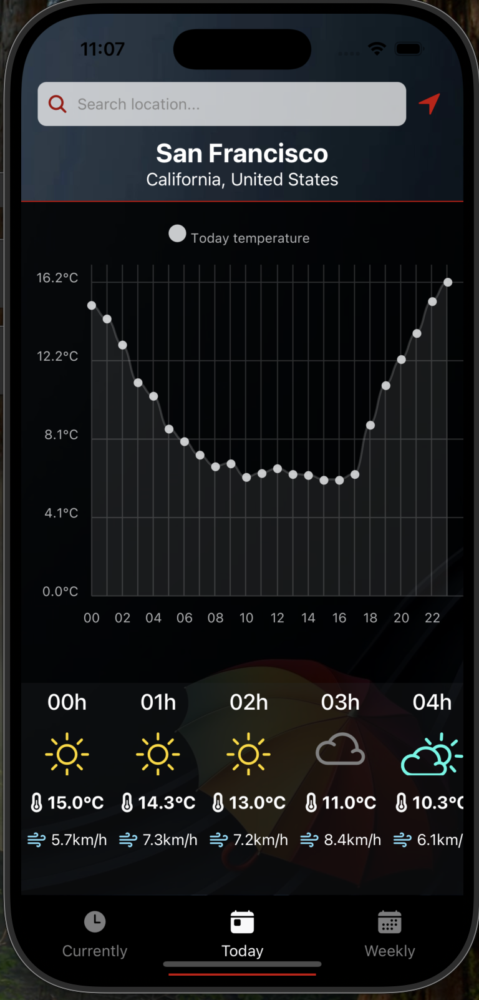
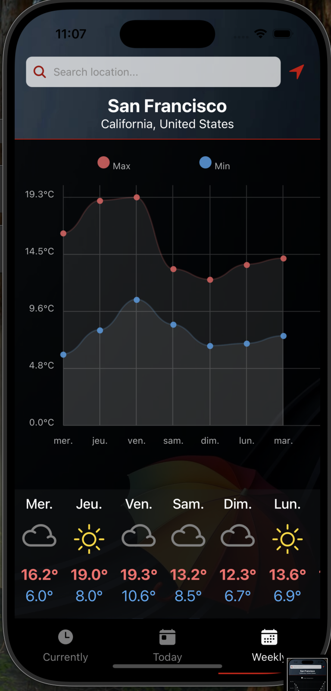

# Weather App ⛅️

## Description 📱
Une application météo moderne et intuitive développée avec React Native et Expo, utilisant l'API Open-Meteo pour les prévisions météorologiques et l'API Google Places pour la géolocalisation inverse. Cette application permet aux utilisateurs de consulter la météo actuelle et les prévisions pour n'importe quelle ville dans le monde, avec une localisation précise des lieux.

## Comment Utiliser 🎯

L'application propose une interface simple et intuitive :

- **Écran Principal** 🏠 : Affiche la météo actuelle de votre position avec le nom exact de la ville
- **Prévisions Horaires** ⏰ : Faites défiler horizontalement pour voir les prévisions heure par heure
- **Prévisions Hebdomadaires** 📅 : Consultez les prévisions des 7 prochains jours
- **Recherche** 🔍 : 
  - Utilisez la barre de recherche avec autocomplétion pour trouver n'importe quelle ville
  - Les résultats incluent les noms complets des lieux avec pays

## Captures d'écran 📸

<div align="center">
  
  
  
</div>

## Fonctionnalités ✨

- **Météo en Temps Réel** 🌡️
  - Température actuelle
  - Conditions météorologiques
  - Humidité et vitesse du vent 💨
  - Indice UV ☀️

- **Prévisions** 📊
  - Prévisions horaires sur 24h ⏱️
  - Prévisions quotidiennes sur 7 jours 📆
  - Détails des précipitations 🌧️

- **Géolocalisation Avancée** 📍
  - Détection automatique de la position de l'utilisateur 🎯
  - Conversion des coordonnées GPS en adresses précises (reverse geocoding) 🗺️
  - Recherche de villes avec autocomplétion 🔍
  - Affichage des noms de lieux détaillés (ville, pays) 🌍

## Installation 🚀

1. Clonez le repository
   ```bash
   git clone https://github.com/votre-username/weather-app.git
   ```

2. Installez les dépendances
   ```bash
   npm install
   ```

3. Configurez vos clés API 🔑
   - Créez un fichier `.env` à la racine du projet
   ```env
   GOOGLE_PLACES_API_KEY=votre_clé_api_google
   ```

4. Lancez l'application
   ```bash
   npx expo start
   ```

## Technologies Utilisées 🛠️

- [Expo](https://expo.dev) - Framework de développement React Native 📱
- [React Native](https://reactnative.dev) - Framework mobile 📱
- [Open-Meteo API](https://open-meteo.com/) - API météorologique gratuite ⛅
- [Google Places API](https://developers.google.com/maps/documentation/places/web-service/overview) - Géocodage inverse et recherche de lieux 🗺️
- [React Navigation](https://reactnavigation.org/) - Navigation entre les écrans 🧭
- [Expo Location](https://docs.expo.dev/versions/latest/sdk/location/) - Géolocalisation 📍
- [React Native Reanimated](https://docs.swmansion.com/react-native-reanimated/) - Animations fluides ✨

## Environnement de Développement 💻

Vous pouvez exécuter l'application sur :
- iOS (via simulateur ou appareil physique) 📱
- Android (via émulateur ou appareil physique) 🤖
- [Expo Go](https://expo.dev/go) 📱

## Structure du Projet 📁

```
app/
├── components/     # Composants réutilisables 🧩
│   ├── WeatherCard/
│   ├── ForecastList/
│   └── SearchBar/
├── screens/       # Écrans de l'application 📱
│   ├── HomeScreen/
│   ├── ForecastScreen/
│   └── SearchScreen/
├── services/      # Services API et utilitaires ⚙️
│   ├── api/
│   ├── location/
│   └── googlePlaces/
├── assets/        # Images, fonts, icônes 🎨
└── constants/     # Constants et configuration ⚙️
```

## Contribution 🤝

Si vous souhaitez contribuer au projet, n'hésitez pas à :
1. Fork le projet 🔄
2. Créer une branche pour votre fonctionnalité 🌿
3. Commiter vos changements 💾
4. Push sur la branche ⬆️
5. Créer une Pull Request 🎯

